# Chapter 1 : Raise to the cloud

32 people : 16 red vs 16 blue in the cloud
1 team won

Since you have found your way here, you must be eager to find out what happened during the "**Chapter 1: Raise to the cloud**" CTF on the **22/11/2018** in **Toulouse**.

## Incoming
Everything began when the **warriors** grabbed their **goodies** bags and settled.
In front of them, two tables facing one another separated by few meters and a virtual real-time dashboard for the incoming battleground cyber-wargame.

Two tables, one on the back for the SOC Masters headquarters, one closer for the pentesters realm, many pizzas and homemade beer and we were all good to begin this whole new joyful experience.

We **split** up the reds and blues according to their wishes and a bit of balancing so we have **50/50** between the teams. Once we distributed stickers to identify SOC from our attackers we briefed individually each team.

## Briefing

**QR code** to join a chat created for the event as well as primary objectives and rules to follow for the evening were communicated. Objectives were actually diverses, some machines where hidden behind others, machines difficulties wide and even a special crafting mission were prepared to entertain our participants.

[Red Briefing](red.md)

[Blue Briefing](blue.md)

## Sneaky mod

Great ambitions for great motivation which generated alternatives communication canals pour share ideas and code to bring the blue team down. Small part began rapidly to code some fake traffic to make the SOC analysts work more complicated while others discovered the machines they had to take over carefully.

## Race condition

After a while full observation period from both side, the red began their mission followed by the blue discoveries. Funny enough, the battleground turned into ping-pong, both teams being pretty much equal in scores most of the evening.

red team divided their work and everyone chose the challenge of their choice and formed many small groups naturally.
As for the blue side, they took their time to discover their new best friend, the solution put in place for them in order to spy the red activities : The SIEM.

## Too confident to win

As for the red-mention of the reddest of the red-team who almost hacked a machine from A to Z without being caught but did a slightly little mistake at the very end who made everyone present laugh ;)

## Ennemy spotted

We cannot end the night and this article without mentionning two special awards of the "what-surprised-organisators-the-most" and it is the representation of the battleground, one for the red and one for the blue.
The blue-mention to the bluest of blue-team who was able to identify physically a member of the red team because of the use of his personal server linked to his identity ;)

## Debrief

The final debrief, making the participants expose their short but intense journey and the score logs analysis highlighted the most important discovery of the evening for both organizers, red team and blue team : blues saw red mistakes while reds successfully sneaky manoeuvres were totally invisible for the first team.

## Easter egg

  * The sweat-shirt ["vieux machin"](https://www.linkedin.com/feed/update/urn:li:activity:6471619967606366208) of Cybercenter Deputy Director had more buzz than the event !
  * Security is better than security even when you discover that you have to give individual accounts to attendees 10 mins after the beginning!
  * We enjoyed so much the party that we forgot to give the *Winner Stickers* to the Blue Team
  * Too many manual work on AWS for this first chapter! Next one we will **Push Left Like A Boss**

# See you for the chapter 2 !
